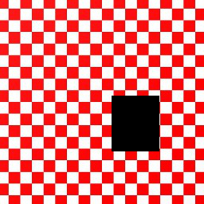
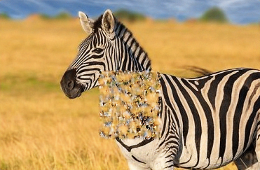

# deep-image-prior
TensorFlow implementation for Deep Image Prior (https://dmitryulyanov.github.io/deep_image_prior)

The paper talks about using large neural networks like ResNet. Due to resource constraints, the networks we use are small. The network was tested for image inpainting, pattern inpainting, and image denoising. Image denoising required early stopping and hyperparameter tuning, and therefore is not perfect.

Pattern inpainting works well on simple patterns, like the following.

 

On more complicated patterns like the one given below, it does not perform really well.

 

Image inpainting requires larger networks. Results on a pair of images have been given below.
Ground truth and inpainted result.

 

Deep image prior understands the overall "texture" of an image and creates a function mapping
from the noise space to the RGB space. To check this, an experiment was done where input noise
patterns were sampled according to a mean and some standard deviation. Prior to this, a network
was trained to take this mean noise vector as input and inpaint the above example (zebra in grass).
The results are shown below.

 
 

Removing overlay text is a form of inpainting. The result are given below.

 

Results on Denoising: Gaussian random noise (stddev = 25) was added using np.random.normal().
The network was trained for 1700 optimizations (the original network was trained for 1800 steps).
The results are given below: 1. Input 2. Denoised (after 1700 iterations) 3. Averaged (last 5)

  

Deep image prior was also tried on depixelating, which is a form of SR. The results are given 2x depixelation and 4x depixelation.

 
 
